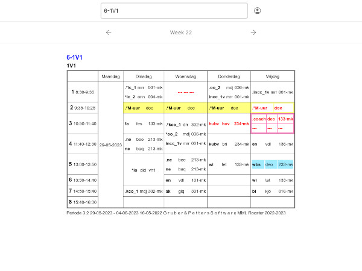

# MML Rooster

A search engine for the MML schedule page.

## About

The official MML schedule page is quite frustrating to use, especially on mobile. This project aims to fix the flaws by presenting the information in a clean, responsive interface. It is still in development, so expect occasional bugs and don't be surprised if it breaks.

## How to use

Simply go to https://rooster.roembol.nl/ (or your own instance), log in with your credentials and search for your schedule.

## How to install

### Requirements

- A Linux server (tested on Debian)
- Docker
- Docker Compose

### Installation

- Clone the repo to your server
- Create a `.env` file in the project root
  - You can find an example configuration in `.env.example`
  - Set `VITE_HOSTNAME` to where you will be hosting the app
  - If you want to enable analytics, add `VITE_ANALYTICS_ENABLED=yes`. You can see how to configure your analytics provider in the `.env.example` file. Note that only Umami Analytics is supported right now.
- Run `make build-prod`
- Run `make run-prod` or `make run-prod-daemon` to start the app
- Don't forget to use a reverse-proxy like Traefik to enable HTTPS

## Development setup

WIP

## License

This project is licensed under the MIT license. See [LICENSE](LICENSE).

## Credits

- [rooster.hetmml.nl](https://github.com/metiscoderclass/rooster.hetmml.nl) for the idea and the general design of the page
